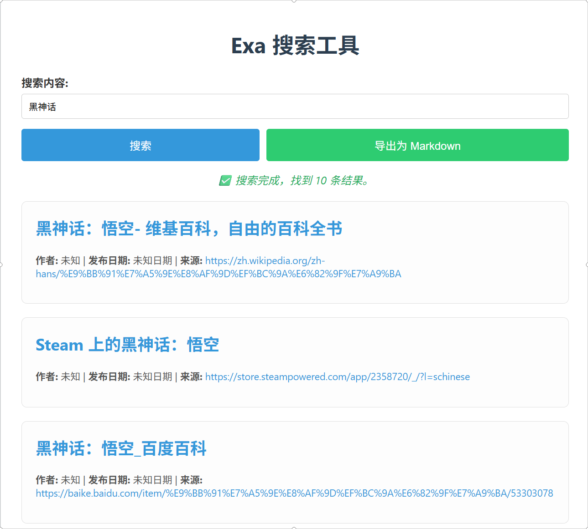

# GetNewsExa-HTML

# GetNews: Exa 驱动的新闻搜索工具

一个基于 Exa API 的本地化网页搜索工具，专注于高效获取新闻和文章内容，并支持将搜索结果一键导出为格式化的 Markdown 文档。

## 📖 目录

- [功能特性](#-功能特性)
- [技术栈](#-技术栈)
- [快速开始](#-快速开始)
- [项目结构](#-项目结构)
- [配置说明](#-配置说明)
- [使用指南](#-使用指南)
- [常见问题](#-常见问题)
- [部署说明](#-部署说明)
- [贡献指南](#-贡献指南)
- [许可证](#-许可证)
- [致谢](#-致谢)

## ✨ 功能特性

- 🔍 **AI 驱动搜索**：利用 [Exa](https://exa.ai) 的先进 AI 模型，进行深度、语义化的新闻和文章内容搜索。
- 🛡️ **安全的本地代理**：内置 Node.js 代理服务器，完美解决浏览器跨域（CORS）限制，确保您的 API Key 仅在本地使用，不会泄露到公网。
- ⚙️ **零依赖配置**：只需在代码中配置一次 Exa API Key，即可永久使用，无需重复输入。
- 📄 **一键导出 Markdown**：将搜索结果（包括标题、链接、作者、发布日期、图片和文中链接）整理成结构化的 `.md` 文件，方便归档和分享。
- 🎨 **现代化 UI**：采用简洁、响应式设计，提供流畅的用户体验。

## 🛠️ 技术栈

- **前端**：`HTML5`, `CSS3`, `Vanilla JavaScript`
- **后端代理**：`Node.js`, `Express.js`
- **外部 API**：[Exa API](https://exa.ai)

## 🚀 快速开始

### 前置要求

请确保您的系统已安装以下软件：

- [Node.js](https://nodejs.org/) (推荐 v16 或更高版本)
- [npm](https://www.npmjs.com/) (通常随 Node.js 一同安装)
- 一个有效的 [Exa API Key](https://exa.ai) (可在官网免费注册获取)

### 安装与运行

1.  **克隆项目**
   
bash
git clone https://github.com/starttown/GetNewsExa-HTML.git
cd GetNewsExa-HTML

2.  **安装依赖**
    项目依赖仅用于代理服务器，运行以下命令安装：
bash
npm.cmd install express cors node-fetch@2

3.  **配置 API Key**
    - 使用文本编辑器打开项目根目录下的 `index.html`。
    - 找到 JavaScript 代码顶部的配置区域。
    - 将 `"exa_..."` 替换为您从 [Exa.ai](https://exa.ai) 获取的真实 API Key。

javascript
// =================== 配置区域 ===================
// 在这里粘贴您的 Exa API Key (以 exa_ 开头)
const API_KEY = “exa_…”; // <— 请在此处替换为您的真实 API Key
// ================================================

    > **安全警告**：请妥善保管您的 API Key，**切勿**将配置好真实 Key 的 `index.html` 文件提交到公共代码仓库。

4.  **启动服务**
    您需要同时启动两个服务，建议开启两个终端窗口。

    - **终端 1：启动代理服务器**
bash
node proxy-server.js

        成功启动后会提示：`Proxy server running at http://localhost:3001`

    - **终端 2：启动前端服务器**
bash
npx.cmd http-server --cors -p 8080

        成功启动后会提示：`Available on: http://127.0.0.1:8080`

5.  **访问应用**
    在浏览器中打开 [http://localhost:8080](http://localhost:8080)，即可开始使用。

## 📁 项目结构

.
├── index.html # 主应用页面 (包含所有前端代码)
├── proxy-server.js # Node.js 后端代理服务器
├── LICENSE # 开源许可证文件
└── README.md # 项目说明文档 (本文件)

## ⚙️ 配置说明

本项目的主要配置项是 **Exa API Key**。

- **如何获取？**
  1. 访问 [Exa.ai](https://exa.ai) 并注册/登录账户。
  2. 在您的账户设置或 API 管理页面，找到您的 API Key。
  3. 复制该 Key 并按照 [快速开始](#-快速开始) 部分的说明配置到 `index.html` 中。

- **安全性**
  本项目通过本地代理服务器使用 API Key，该 Key 不会在浏览器中直接发送给 Exa API，而是由您的本地服务器转发。这能有效防止 Key 在前端暴露，但请勿将配置好真实 Key 的 `index.html` 文件上传到公共仓库。

## 📖 使用指南

1.  在搜索框中输入您感兴趣的关键词或问题（例如 "artificial intelligence news"）。
2.  点击“搜索”按钮，等待结果加载。
3.  浏览搜索结果，每个结果都包含标题、摘要、作者、日期等信息。
4.  如需保存，点击“导出为 Markdown”按钮，浏览器会自动下载一个包含所有结果的 `.md` 文件。

## ❓ 常见问题

<strong>Q: 点击搜索后提示 "Failed to fetch" 或 "net::ERR_CONNECTION_REFUSED"？</strong>

**A:** 这通常意味着您的代理服务器没有运行。请检查：
1. 是否在另一个终端窗口中运行了 `node proxy-server.js`。
2. 代理服务器是否提示 `Proxy server running at http://localhost:3001`。
3. 确保没有关闭运行代理服务器的终端窗口。

<strong>Q: 搜索时提示 "x-api-key header is invalid"？</strong>

**A:** 这表示您的 API Key 无效。请检查：
1. 您在 `index.html` 中配置的 Key 是否是正确的 Exa API Key（通常以 `exa_` 开头）。
2. Key 是否已过期或被禁用。
3. 复制时是否有多余的空格或换行符。

<strong>Q: 启动前端服务器时提示端口 `8080` 已被占用？</strong>

**A:** 这表示您的电脑上已有其他程序在使用 8080 端口。您可以：
1. 关闭占用该端口的程序。
2. 或者使用另一个端口，例如：`npx http-server --cors -p 8081`，然后在浏览器中访问 `http://localhost:8081`。

## 🌐 部署说明

**重要提示**：本项目设计为在本地运行，以保护您的 API Key 安全。它**不能**直接部署到 GitHub Pages 等静态托管平台，因为它需要一个后端代理服务器。

- **对于大多数用户**：请按照 [快速开始](#-快速开始) 指南在本地运行即可。将代码托管在 GitHub 上是为了方便分享和协作，而不是为了在线运行。
- **对于高级用户**：如果您希望将此项目部署为一个在线服务，您需要一个支持 Node.js 的云服务器（如 Render, Heroku, Vercel Serverless, DigitalOcean 等）。这需要修改代码以使用环境变量来管理 API Key，并调整前后端的通信地址。这超出了本项目的简易范畴，但完全可以实现。

## 🤝 贡献指南

我们欢迎所有形式的贡献！

1.  **Fork** 本仓库。
2.  创建您的特性分支 (`git checkout -b feature/AmazingFeature`)。
3.  提交您的更改 (`git commit -m 'Add some AmazingFeature'`)。
4.  推送到分支 (`git push origin feature/AmazingFeature`)。
5.  创建一个 **Pull Request**。

## 📄 许可证

本项目采用 [MIT 许可证](LICENSE)。

## 🙏 致谢

- 感谢 [Exa](https://exa.ai) 团队提供了如此强大的搜索 API。
- 感谢 `http-server` 和 `express.js` 等优秀开源项目。